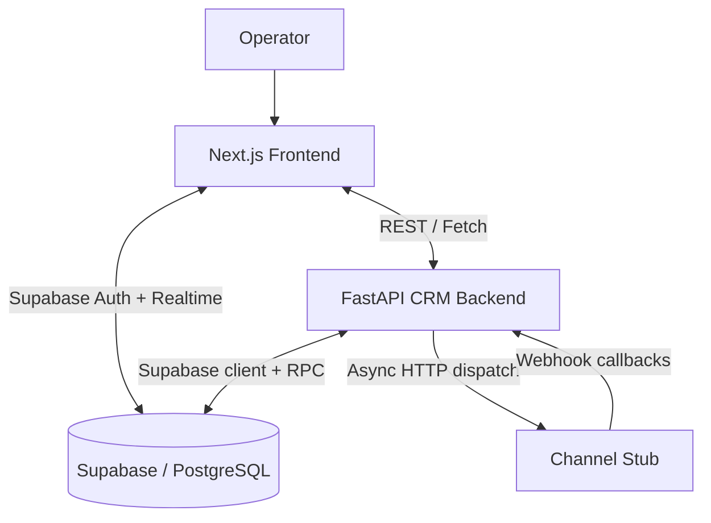

# Maeven CRM

Maeven CRM is an AI-native retail analytics and messaging platform for premium retail and D2C brands. The workspace combines a FastAPI backend, a Next.js frontend, a Supabase/PostgreSQL data layer, and a simulated delivery gateway so the full campaign lifecycle can be exercised locally.

## Project Summary

This repository is organized as a small multi-service product stack rather than a single app. The frontend provides the operator interface, the backend exposes the CRM and analytics API, and the channel stub simulates external messaging providers such as email, SMS, and WhatsApp.

The system is designed around three core ideas:

1. Customer analytics are computed from transaction history and stored back into the CRM database.
2. Segments and campaigns can be created manually or generated from natural language using an AI model.
3. Campaign execution is asynchronous and feeds delivery receipts back into the CRM so the UI can show live status updates.

## High-Level Architecture

The architecture is intentionally demo-friendly: the frontend is polished and interactive, while the backend and simulator make the data flow feel production-like without needing real third-party messaging providers.

## Repository Layout

- [schema.sql](schema.sql) defines the database schema, campaign stats RPC, indexes, and realtime publication setup.
- [seed.py](seed.py) seeds customers, products, and orders with a realistic jewelry-retail dataset.
- [start.ps1](start.ps1) launches the backend, channel stub, and frontend in separate terminals.
- [crm-backend/](crm-backend) contains the main CRM API service.
- [channel-stub/](channel-stub) contains the async message delivery simulator.
- [frontend/](frontend) contains the Next.js application.

## Services

### CRM Backend

The backend lives in [crm-backend/main.py](crm-backend/main.py) and serves the main FastAPI app on port 8000. It registers routers for customers, segments, campaigns, AI, receipts, deals, tickets, and webhooks. The app also configures CORS so the frontend can talk to it from the local development origin.

Key responsibilities:

- CRUD operations for customers, segments, campaigns, deals, and tickets.
- Customer export and import workflows.
- Bulk RFM recomputation from order history.
- Natural language segment compilation and AI campaign assistance.
- Campaign execution orchestration and analytics persistence.
- Receipt handling for delivery lifecycle events.

### Channel Stub

The async gateway in [channel-stub/main.py](channel-stub/main.py) listens on port 8001. It accepts message send requests, starts a simulation worker, and posts lifecycle callbacks back to the CRM backend. The simulator in [channel-stub/simulator.py](channel-stub/simulator.py) introduces delays and probabilistic events such as delivered, opened, read, and clicked.

### Frontend

The frontend is a Next.js 14 app in [frontend/](frontend) with Tailwind CSS, Recharts, Lucide icons, Supabase auth, and Supabase realtime subscriptions. It renders the operational UI for the CRM, including the dashboard, customer directory, segment builder, campaign registry, campaign detail view, chat assistant, and login/signup screens.

## Data Model

The database schema in [schema.sql](schema.sql) centers on a retail CRM model:

- `customers` stores profile data, tags, RFM scores, churn risk, and dormancy state.
- `products` stores catalog items and collection metadata.
- `orders` stores transactional history used for analytics.
- `segments` stores logical customer cohorts and AI-compiled filter definitions.
- `campaigns` stores campaign drafts, execution state, and message templates.
- `communications` stores one row per delivered or queued message attempt.
- `campaign_stats` stores aggregate performance counters and derived rates.
- `deals` and `tickets` support sales pipeline and shared support workflows.

The schema also defines the `increment_campaign_stat` RPC, which updates analytics atomically and recomputes delivery, open, and click rates.

## Main User Flows

### Customer Analytics

Customer data is displayed in [frontend/src/app/customers/page.tsx](frontend/src/app/customers/page.tsx). The page can filter by search, city, RFM segment, dormancy status, and minimum spend. It can also import customer files, export customer data, and trigger a backend RFM recomputation job.

The recomputation path uses the order history to recalculate:

- total orders
- total spent
- last purchase date
- RFM score
- RFM segment
- dormancy status
- churn risk

### Segment Building

Segments can be created manually or via natural language in [frontend/src/app/segments/page.tsx](frontend/src/app/segments/page.tsx). The backend endpoint [crm-backend/routers/segments.py](crm-backend/routers/segments.py) validates filter payloads and can compile natural language into structured filters using xAI/Grok, with a local regex fallback when AI credentials are unavailable.

### Campaign Execution

The campaign workflow is the heart of the system:

1. A segment is selected or created.
2. A campaign draft is saved.
3. The backend resolves matching customers.
4. Communications are created for each customer.
5. The channel stub simulates message delivery and engagement.
6. Webhook callbacks update communication rows and campaign stats.
7. The frontend campaign detail page reflects live progress through Supabase realtime.

This flow is implemented across [crm-backend/routers/campaigns.py](crm-backend/routers/campaigns.py), [channel-stub/simulator.py](channel-stub/simulator.py), [channel-stub/callbacks.py](channel-stub/callbacks.py), and [crm-backend/routers/receipt.py](crm-backend/routers/receipt.py).

### AI Assistant

The chat assistant in [frontend/src/app/chat/page.tsx](frontend/src/app/chat/page.tsx) and [frontend/src/components/ChatComposer.tsx](frontend/src/components/ChatComposer.tsx) sends prompts to the backend AI router. The assistant can:

- infer a customer segment from conversational input,
- generate marketing copy drafts,
- recommend a channel,
- and execute a campaign directly from the response UI.

### Live Campaign Tracking

The campaign detail page in [frontend/src/app/campaigns/[id]/page.tsx](frontend/src/app/campaigns/[id]/page.tsx) fetches campaign stats and subscribes to realtime changes on `campaign_stats`. That allows the page to show a live funnel and a post-campaign AI debrief once execution starts.

## Frontend Structure

The UI is organized around a persistent authenticated shell:

- [frontend/src/app/layout.tsx](frontend/src/app/layout.tsx) sets up the root providers and toast system.
- [frontend/src/components/AuthGate.tsx](frontend/src/components/AuthGate.tsx) redirects unauthenticated users to login pages and renders the sidebar shell for authenticated users.
- [frontend/src/components/Sidebar.tsx](frontend/src/components/Sidebar.tsx) provides navigation.
- [frontend/src/lib/auth-context.tsx](frontend/src/lib/auth-context.tsx) tracks Supabase session state.
- [frontend/src/lib/supabase.ts](frontend/src/lib/supabase.ts) creates the browser Supabase client.

The design language uses a dark editorial look with gold accents, serif headings, and chart-heavy layout blocks. It is intentionally more premium than generic admin UI.

## Backend Design Notes

The backend uses Supabase as the data store instead of a local ORM. Most route handlers operate by querying and updating tables directly through the Supabase Python client.

Important patterns:

- `crm-backend/models.py` creates a shared Supabase client.
- `crm-backend/dependencies.py` provides session verification and a basic rate limiter.
- `crm-backend/routers/customers.py` derives analytics from orders at read time and also persists recalculated customer metrics.
- `crm-backend/routers/campaigns.py` is responsible for orchestration, customer resolution, and message dispatch.
- `crm-backend/routers/receipt.py` enforces a webhook secret before accepting lifecycle updates.

## Environment Variables

The project expects environment variables for Supabase, backend URLs, and AI integration. The most important ones are:

- `SUPABASE_URL`
- `SUPABASE_KEY` or `SUPABASE_SERVICE_ROLE_KEY`
- `NEXT_PUBLIC_SUPABASE_URL`
- `NEXT_PUBLIC_SUPABASE_ANON_KEY`
- `NEXT_PUBLIC_BACKEND_URL`
- `NEXT_PUBLIC_FRONTEND_URL`
- `CHANNEL_STUB_URL`
- `CRM_RECEIPT_URL`
- `WEBHOOK_SECRET`
- `XAI_API_KEY` or `GROK_API_KEY`
- `XAI_BASE_URL`
- `XAI_MODEL`
- `STRICT_AUTH`

## Setup Overview

The intended local startup path is:

1. Create and configure the Supabase project.
2. Run [schema.sql](schema.sql) in the SQL editor.
3. Seed the database using [seed.py](seed.py) and the service-specific seed scripts if needed.
4. Start the three services with [start.ps1](start.ps1).
5. Open the frontend in the browser and authenticate with Supabase.

## Known Tradeoffs

This repo is functional, but it still has some deliberate demo-oriented shortcuts:

- Authentication is soft by default unless `STRICT_AUTH=true` is set.
- Some dashboard and insights content is static or historical rather than live-drawn from APIs.
- Several pages assume the local backend and channel stub are running on their default ports.
- The schema and seeding logic depend on Supabase features being available and configured correctly.

## What This Project Is Good At

- Demonstrating a full CRM workflow end to end.
- Showing how an AI copilot can assist with segmentation and campaign drafting.
- Simulating campaign delivery and engagement without real messaging vendors.
- Presenting operational analytics in a polished frontend.

## Suggested Next Steps

1. Add a short deployment section for production or preview environments.
2. Document each backend endpoint in a dedicated API reference.
3. Add screenshots or GIFs for the main UI flows.
4. Tighten auth and replace demo-only defaults before production use.
5. See [PAGE_COMPONENTS.md](PAGE_COMPONENTS.md) for a page-by-page breakdown of the frontend UI and component responsibilities.

