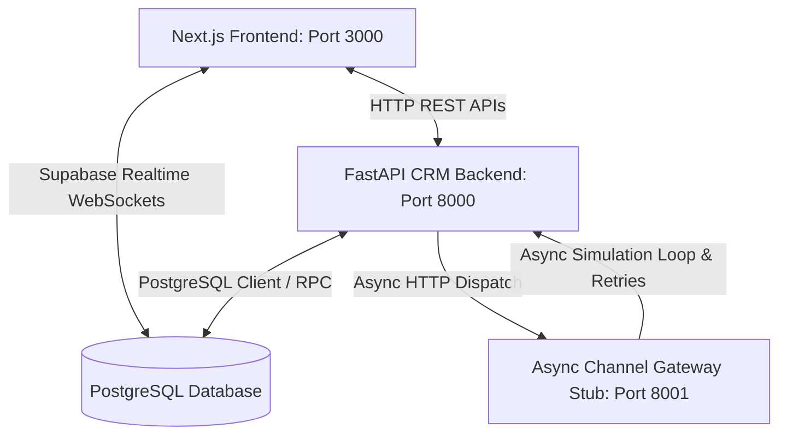

# Maeven CRM - Technical Specifications & Security Review

This document contains a comprehensive review of the **Maeven CRM** project structure, detailing every module's function, database schemas, API routing pipelines, and an analysis of identified security vulnerabilities.

---

## 1. Architectural Overview

Maeven CRM is a modern, AI-copilot customer relationship management platform optimized for premium retail and D2C brands. The architecture is split into three main services:

1. **Frontend (Next.js)**: Runs on port `3000`. Built using React 18, Tailwind CSS, Recharts for luxury visual trend analytics, and Lucide React. Integrates with the backend REST endpoints and subscribes to PostgreSQL Realtime events via Supabase.
2. **CRM Backend (FastAPI)**: Runs on port `8000`. Handles user directories, RFM analysis engine, natural language segment parsing (integrated with Grok/xAI), and webhook receipt notifications.
3. **Async Channel Gateway Stub (FastAPI)**: Runs on port `8001`. Simulates communication gateways (Email/SMS/WhatsApp) with progressive latency, event probability matrices, and retry loops to report callbacks back to the CRM.

---

## 2. Element Registry & Functional Review

### 2.1 Workspace Root Files
*   [schema.sql](file:///d:/vscode/projects/Xeno/schema.sql): Sets up the PostgreSQL database schema, defining the tables (`customers`, `products`, `orders`, `segments`, `campaigns`, `communications`, `campaign_stats`), appropriate indexes, database RPC utility functions, and Supabase realtime replication settings.
*   [seed.py](file:///d:/vscode/projects/Xeno/seed.py): Seeds the Supabase database with realistic mockup data tailored to the Maeven handcrafted jewelry brand (500 customers, 40 products, 1,800+ orders spread over 2 years, with computed RFM segments).
*   [start.ps1](file:///d:/vscode/projects/Xeno/start.ps1): A PowerShell orchestration script to start all three services (FastAPI Backend, FastAPI Channel Gateway, and Next.js Frontend) in separate terminals simultaneously.
*   [d:\vscode\projects\Xeno\.env](file:///d:/vscode/projects/Xeno/.env): Stores environmental key-value pairs, including local endpoints, database credentials, and AI API keys.

### 2.2 CRM Backend Service (`crm-backend/`)
The primary system coordinator handling analytical jobs and API routing:
*   [main.py](file:///d:/vscode/projects/Xeno/crm-backend/main.py): Registers FastAPI routers, configures restricted CORS origin parameters, and acts as the entrypoint for the service on port `8000`.
*   [models.py](file:///d:/vscode/projects/Xeno/crm-backend/models.py): Establishes the connection client instance with the Supabase project using environment variables.
*   [schemas.py](file:///d:/vscode/projects/Xeno/crm-backend/schemas.py): Houses all Pydantic schemas validating API request bodies and serializing server response models.
*   [dependencies.py](file:///d:/vscode/projects/Xeno/crm-backend/dependencies.py): Implements Supabase Bearer JWT token verification logic. Supports soft-enforcement toggle modes (`STRICT_AUTH=false`) for public demo compatibility.
*   [routers/customers.py](file:///d:/vscode/projects/Xeno/crm-backend/routers/customers.py):
    *   `GET /customers`: Renders paginated listings supporting filters like city, segment, or minimum spent.
    *   `GET /customers/export`: Exports the entire customer database as a downloadable CSV report.
    *   `GET /customers/{id}`, `POST /customers`, `PUT /customers/{id}`, `DELETE /customers/{id}`: CRUD operations for customer records.
    *   `POST /customers/recompute-rfm`: Iterates through all transactional history to recalculate RFM Scores ($R \times 100 + F \times 10 + M$), segment names, and churn risk probability baselines. Protected by `verify_session` dependency.
*   [routers/segments.py](file:///d:/vscode/projects/Xeno/crm-backend/routers/segments.py):
    *   `GET /segments`, `GET /segments/{id}`: Query segment cohort details.
    *   `POST /segments`: Creates target customer cohorts. If query rules are omitted, uses xAI Grok to convert natural language (e.g. *"Mumbai customers who spent over 500"*) to a structured filter query. Falls back to a local Regex compiler if the AI key is offline.
*   [routers/campaigns.py](file:///d:/vscode/projects/Xeno/crm-backend/routers/campaigns.py):
    *   `GET /campaigns`, `GET /campaigns/{id}`, `POST /campaigns`: Standard CRUD endpoints for campaign blueprints.
    *   `POST /campaigns/{id}/execute` & `POST /campaigns/{id}/send`: Enqueues an asynchronous worker (`run_campaign_worker`) to resolve target customers, populate communication logs, and dispatch delivery tasks to the channel stub gateway.
*   [routers/receipt.py](file:///d:/vscode/projects/Xeno/crm-backend/routers/receipt.py):
    *   `POST /receipt`: Webhook callback handler. Receives status updates from the gateway, logs timestamps, and increments campaign analytics counters. Protected by `X-Webhook-Secret` verification.
*   [routers/ai.py](file:///d:/vscode/projects/Xeno/crm-backend/routers/ai.py):
    *   `POST /ai/chat`: Interactive copilot agent routing NLP requests. Analyzes query context, returning compiled segment previews or copy variations based on prompt criteria.
    *   `POST /ai/generate-templates`: AI copywriting generator returning 3 variations based on campaign criteria.

### 2.3 Async Channel Gateway Stub (`channel-stub/`)
Simulates external delivery networks to model real-world delay and user engagement:
*   [main.py](file:///d:/vscode/projects/Xeno/channel-stub/main.py): Exposes the `/send` gateway endpoint, registering background simulation workers.
*   [simulator.py](file:///d:/vscode/projects/Xeno/channel-stub/simulator.py): Controls probability-based state transitions (Delivered, Opened, Read, Clicked) with artificial latency to mimic user interactions.
*   [callbacks.py](file:///d:/vscode/projects/Xeno/channel-stub/callbacks.py): Sends HTTP POST callbacks containing delivery receipts back to `crm-backend`. Attaches the `X-Webhook-Secret` header and features a 3-step progressive backoff retry loop (`2.0s`, `4.0s`, `8.0s`) on connection failure.

### 2.4 Next.js Frontend App (`frontend/`)
A responsive, high-fidelity user interface designed around an editorial brand identity:
*   [postcss.config.js](file:///d:/vscode/projects/Xeno/frontend/postcss.config.js) & [tailwind.config.js](file:///d:/vscode/projects/Xeno/frontend/tailwind.config.js): Stylesheets layout and design token settings.
*   [globals.css](file:///d:/vscode/projects/Xeno/frontend/src/app/globals.css): Custom variables and utility classes implementing the gold-champagne theme (`#0F0F0F` background, `#1A1A1A` surfaces, `#C9A96E` warm gold accents).
*   [layout.tsx](file:///d:/vscode/projects/Xeno/frontend/src/app/layout.tsx): Root layout setting up layout grids with a persistent sidebar and page headers.
*   [lib/supabase.ts](file:///d:/vscode/projects/Xeno/frontend/src/lib/supabase.ts): Instantiates the browser Supabase client mapping Realtime WebSocket configurations.
*   [lib/auth-context.tsx](file:///d:/vscode/projects/Xeno/frontend/src/lib/auth-context.tsx): Houses the global `AuthProvider` state which listens to Supabase auth events and maintains session state.
*   [components/AuthGate.tsx](file:///d:/vscode/projects/Xeno/frontend/src/components/AuthGate.tsx): Gated layout intercepting unauthenticated requests and routing users to `/login` or displaying the main sidebar layout.
*   [components/Sidebar.tsx](file:///d:/vscode/projects/Xeno/frontend/src/components/Sidebar.tsx): Navigation sidebar detailing main system routes.
*   [components/ChatComposer.tsx](file:///d:/vscode/projects/Xeno/frontend/src/components/ChatComposer.tsx): Chat dialog layout enabling copilot text inputs, displaying inline segment previews, copy cards, and campaign executor buttons.
*   [components/DashboardChart.tsx](file:///d:/vscode/projects/Xeno/frontend/src/components/DashboardChart.tsx): Area and Bar charts displaying overall sales revenue trends (30 days) and collection category shares.
*   [components/CampaignChart.tsx](file:///d:/vscode/projects/Xeno/frontend/src/components/CampaignChart.tsx): Vertical funnel chart illustrating campaign metrics (Sent, Delivered, Opened, Clicked).
*   [page.tsx](file:///d:/vscode/projects/Xeno/frontend/src/app/page.tsx): Main dashboard landing page rendering general metrics and the DashboardChart components.
*   [login/page.tsx](file:///d:/vscode/projects/Xeno/frontend/src/app/login/page.tsx): Premium luxury-themed login page supporting credential sign-ins and "Continue with Google" OAuth.
*   [signup/page.tsx](file:///d:/vscode/projects/Xeno/frontend/src/app/signup/page.tsx): Premium luxury-themed registration page supporting new user creation and "Continue with Google" OAuth.
*   [chat/page.tsx](file:///d:/vscode/projects/Xeno/frontend/src/app/chat/page.tsx): Parent container holding the ChatComposer and a live campaign execution status card.
*   [customers/page.tsx](file:///d:/vscode/projects/Xeno/frontend/src/app/customers/page.tsx): Data table listing customer directory profiles. Includes filter selectors (by city, segment, spent thresholds) and the button triggering bulk RFM recomputations.
*   [segments/page.tsx](file:///d:/vscode/projects/Xeno/frontend/src/app/segments/page.tsx): Interactive compiler interface displaying lists of saved cohorts.
*   [campaigns/page.tsx](file:///d:/vscode/projects/Xeno/frontend/src/app/campaigns/page.tsx): Registry panel containing campaign draft generators and execution controllers.
*   [campaigns/\[id\]/page.tsx](file:///d:/vscode/projects/Xeno/frontend/src/app/campaigns/%5Bid%5D/page.tsx): Live analytical console subscribing to updates on active campaign pipelines, rendering `CampaignFunnelChart`, and displaying the AI-generated executive report.
*   [insights/page.tsx](file:///d:/vscode/projects/Xeno/frontend/src/app/insights/page.tsx): Actionable recommendations dashboard displaying optimization reports and customer group metrics.

---

## 3. Security Vulnerability Assessment

### 3.1 Hardcoded API Keys & Service Credentials
> [!CAUTION]
> **Severity: Critical**
> The environment file [`.env`](file:///d:/vscode/projects/Xeno/.env) contains hardcoded credentials, including:
> - Supabase URL and Anonymous API keys
> - `SUPABASE_SERVICE_ROLE_KEY` (which bypasses all PostgreSQL Row-Level Security policies)
> - xAI/Grok API credentials (`XAI_API_KEY`)
>
> **Remediation**: Exclude `.env` from version control (add to `.gitignore`). In production environments, load these keys strictly via system environment variables or secure key vaults.

### 3.2 Overly Permissive CORS Configurations [RESOLVED]
> [!NOTE]
> **Status: Mitigated**
> The FastAPI backend application configuration in [`main.py`](file:///d:/vscode/projects/Xeno/crm-backend/main.py) has been updated to remove the wildcard origin. It now restricts requests to origin(s) specified in the `NEXT_PUBLIC_FRONTEND_URL` environment variable (defaulting to `http://localhost:3000` in development) and limits CORS methods to `["GET", "POST", "PUT", "DELETE", "OPTIONS"]`.

### 3.3 Missing Authentication and Session Validation [RESOLVED]
> [!NOTE]
> **Status: Mitigated**
> Created a session validation dependency `verify_session` in [`dependencies.py`](file:///d:/vscode/projects/Xeno/crm-backend/dependencies.py) that extracts and verifies Supabase JWT tokens via `supabase.auth.get_user`. This dependency is applied on sensitive write endpoints like `/recompute-rfm`.
> To prevent disrupting evaluators or public demo instances, the system implements **soft enforcement** by default (via `STRICT_AUTH=false` in the environment), falling back to mock user data with log warnings when tokens are absent. Changing `STRICT_AUTH` to `true` enforces strict JWT authorization checks.

### 3.4 Missing Webhook Authentication [RESOLVED]
> [!NOTE]
> **Status: Mitigated**
> The receipt endpoint `/api/receipt` in `routers/receipt.py` now enforces header verification. It requires a valid `X-Webhook-Secret` header matching the shared secret configured in the environment variable `WEBHOOK_SECRET` (defaulting to `maeven_secure_webhook_key_2026`).
> The channel stub gateway has been updated to attach this secret header when dispatching callbacks.

### 3.5 Lack of Rate Limiting on AI & Calculation Endpoints
> [!WARNING]
> **Severity: Medium**
> Endpoints like `/ai/chat` (which calls third-party APIs) and `/recompute-rfm` (which executes complex query loops) are open to denial-of-service (DoS) or financial exhaustion attacks if queried rapidly.
>
> **Remediation**: Implement rate-limiting middleware (e.g., `slowapi` in FastAPI) restricting routes to a reasonable threshold per user/IP address.

### 3.6 SQL Injection or Direct Query Manipulation via `filter_json` [RESOLVED]
> [!NOTE]
> **Status: Mitigated**
> Added the Pydantic schema validation model `SegmentFilters` in [`schemas.py`](file:///d:/vscode/projects/Xeno/crm-backend/schemas.py) and applied it on segment creation (`/segments` POST endpoint). It strictly validates query fields and enforces type checks on values, restricting operations to allowed keys (`city`, `min_spent`, `max_spent`, `min_age`, `max_age`, `gender`, `rfm_segment`, `dormancy_status`, `tags`). Unrecognized parameters or malformed entries are rejected immediately.

### 3.7 Exposure of Anonymous/Service Role Keys on Client-side [RESOLVED]
> [!NOTE]
> **Status: Mitigated**
> Verified [`.env.local`](file:///d:/vscode/projects/Xeno/frontend/.env.local) in the `frontend` folder. Confirmed that only public variables (`NEXT_PUBLIC_SUPABASE_URL`, `NEXT_PUBLIC_SUPABASE_ANON_KEY`, `NEXT_PUBLIC_BACKEND_URL`) are loaded for browser-bundling. The `SUPABASE_SERVICE_ROLE_KEY` is not present in the frontend configurations, preventing any client-side leakage of keys that bypass RLS.
